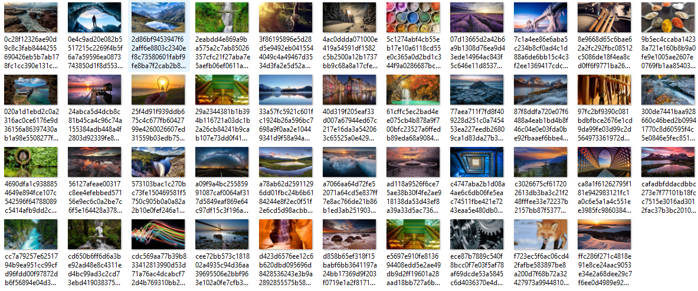

# How to save Windows 10 Spotlight Lockscreen images with PowerShell
Windows Spotlight is an option for the lock screen background that displays different background images and occasionally offers suggestions on the lock screen. Windows Spotlight is available in all desktop editions of Windows 10 and it will display a new image on the lock screen each day.

I have to confess I’m a fan of Windows Spotlight lock screen images. Some of those pictures are simply amazing and other tend to be awe-inspiring… and sometimes I want to save them to use it our laptop or mobile wallpaper, in a digital album or in a presentation slide.

There are many ways to manually archive this goal, spotlight images are cached on your local PC and hidden in a particular folder, so you can do there a manually copy the files and rename them. However, I prefer to automate this task in order to lose as little time as possible and reuse periodically.

 
THIS POWERSHELL IS PROVIDED "AS IS", WITHOUT WARRANTY OF ANY KIND.

# About Me
**Sandro Pereira** | [DevScope](http://www.devscope.net/) | MVP & MCTS BizTalk Server 2010 | [https://blog.sandro-pereira.com/](https://blog.sandro-pereira.com/) | [@sandro_asp](https://twitter.com/sandro_asp)